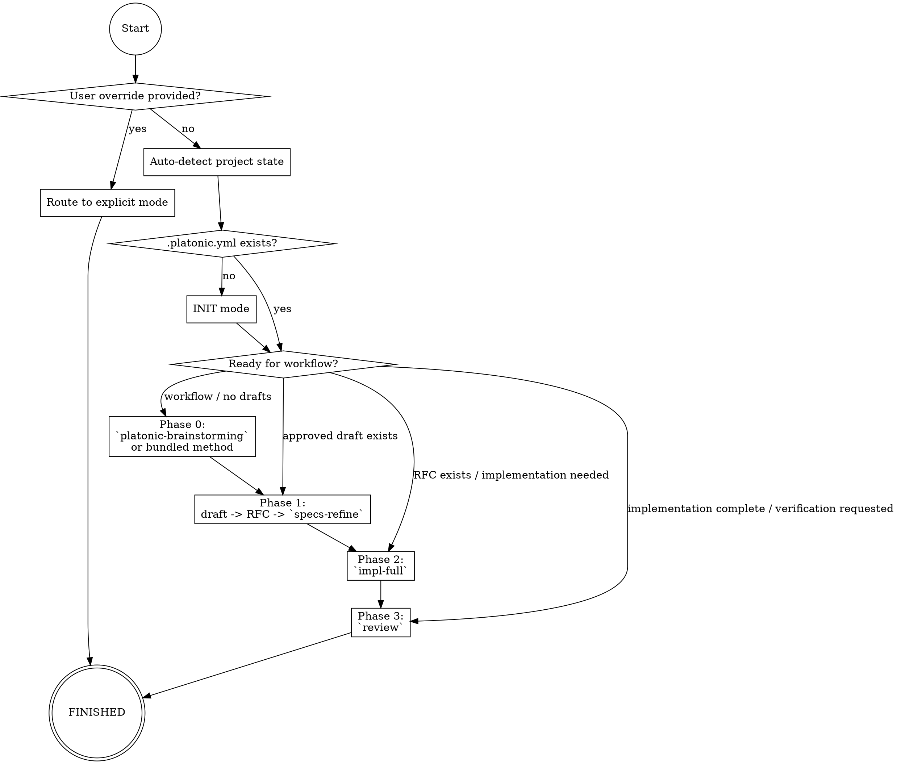

# Platonic Coding

Intelligent orchestrator for the complete **specification-driven development lifecycle**. Auto-detects project state and executes the appropriate workflow phases—initialization, specification management, implementation, or review. Integrates with `platonic-brainstorming` as an optional Phase 0 accelerator when you want structured design exploration before RFC formalization.

## When to Use This Skill

Use this skill when you need to:

- **Bootstrap** a new project with Platonic Coding infrastructure
- **Adopt** Platonic Coding for an existing codebase (recover specs from code)
- **Manage** RFC specifications (validate, refine, generate indices)
- **Implement** features from RFC specs with guides and tests
- **Review** code for spec compliance
- **Run** the full workflow from design → RFC → code → review

**Keywords**: platonic coding, specs, RFC, implementation, review, workflow, spec-driven, initialization

## Intelligent Auto-Detection

When invoked without specific instructions, this skill **automatically detects** project state and suggests the next action.

### Detection Algorithm

```
1. Does .platonic.yml exist?
   → NO:  Run INIT mode
          • Has source code? → run the recovery flow (`init-scan` -> recovery operations)
          • No code? → `init-scaffold`

2. Has specs directory but no RFCs?
   → Has design drafts? → WORKFLOW Phase 1 (draft -> RFC -> `specs-refine`)
   → No drafts? → WORKFLOW Phase 0 (conceptual design)

3. Has RFCs but no implementation guides?
   → WORKFLOW Phase 2 (`impl-full` or `impl-create-guide`)

4. Has RFCs and implementation guides?
   → If implementation is still in progress, resume IMPL mode
   → If implementation appears complete or the user asks for verification, run REVIEW mode

5. Has specs but the next step is ambiguous?
   → Resume from the current workflow phase or ask whether the user wants refine / implement / review
```

### User Override

Users can explicitly specify operations to bypass auto-detection. Prefer the canonical operation names directly:

- `init-scaffold`
- `init-scan`
- `init-plan-modular-specs`
- `init-recover-conceptual`
- `init-recover-architecture`
- `init-recover-impl-interface`
- `specs-refine` and other `specs-*` operations
- `impl-full` and other `impl-*` operations
- `review`
- `workflow --phase <N>`

If you support shorthand like `--init` or `--workflow`, treat it as a convenience wrapper around the canonical operation flow above.

## Core Workflow Phases

The Platonic Coding workflow follows four phases:

| Phase | Focus | Output | Mode |
|-------|-------|--------|------|
| **0** | Conceptual Design | Design draft (`docs/drafts/`) | WORKFLOW |
| **1** | RFC Specification | RFCs (`docs/specs/`) | WORKFLOW / SPECS |
| **2** | Implementation | Guide + Code + Tests | WORKFLOW / IMPL |
| **3** | Spec Compliance Review | Review report | WORKFLOW / REVIEW |

## Operation Modes

### INIT Mode

**Purpose**: Bootstrap Platonic Coding infrastructure

**Operations** (see `references/INIT/`):
- `init-scaffold`: Create `.platonic.yml`, directories, templates
- `init-scan`: Analyze existing codebase (recovery mode)
- `init-plan-modular-specs`: Propose RFC dependency graph
- `init-recover-conceptual`: Generate conceptual design RFC
- `init-recover-architecture`: Generate architecture design RFCs
- `init-recover-impl-interface`: Generate impl interface RFCs (optional)

**Auto-detection**: Runs when `.platonic.yml` is missing

**Examples**:
```
# Auto-detect: new vs existing project
Use platonic-coding to set up my new project.

# Explicit: existing codebase recovery flow
Use platonic-coding init-scan, then recover the core specs for this codebase.

# Explicit: greenfield scaffold
Use platonic-coding init-scaffold for project "Acme" (TypeScript/Next.js).
```

**Reference**: See `references/REFERENCE.md` → INITIALIZATION section

---

### SPECS Mode

**Purpose**: Manage RFC specifications

**Operations** (see `references/SPECS/`):
- `specs-refine`: Comprehensive validation and update
- `specs-generate-history`: Update RFC change history
- `specs-generate-index`: Update RFC index
- `specs-generate-namings`: Update terminology reference
- `specs-validate-consistency`: Check cross-references and metadata
- `specs-check-taxonomy`: Verify terminology usage
- `specs-check-compliance`: Validate against RFC standard

**Auto-detection**: Suggested when specs exist but need validation

**Examples**:
```
# Auto-detect: refine all specs
Use platonic-coding to validate and update all specifications.

# Explicit: specific operation
Use platonic-coding specs-generate-index to update the RFC index.

# Explicit: comprehensive refinement
Use platonic-coding specs-refine to run all validation and generation operations.
```

**Reference**: See `references/REFERENCE.md` → SPECIFICATION section

---

### IMPL Mode

**Purpose**: Translate RFCs into implementation guides and code

**Operations** (see `references/IMPL/`):
- `impl-full`: End-to-end: spec → guide → plan → code + tests (default)
- `impl-create-guide`: Generate implementation guide from RFC
- `impl-code`: Implement code from existing guide
- `impl-validate-guide`: Check guide against RFC for contradictions
- `impl-update-guide`: Update guide when RFC changes

**Auto-detection**: Suggested when an RFC is ready for implementation and no implementation guide exists for that target

**Confirmation Gates**: By default, pauses after impl guide and coding plan for user confirmation. Can be overridden with "no confirmations" or auto-mode.

**Examples**:
```
# Auto-detect: implement from RFC
Use platonic-coding to implement RFC-0042-message-queue (Message Queue) in the acme-queue module.

# Explicit: create guide only
Use platonic-coding impl-create-guide for RFC-0001-user-authentication, guide only, no coding.

# Explicit: implement from existing guide
Use platonic-coding impl-code from docs/impl/IG-001-user-authentication.md.

# Auto-mode: no confirmations
Use platonic-coding impl-full for RFC-0003-notification-routing without stopping for confirmation.
```

**Reference**: See `references/REFERENCE.md` → IMPLEMENTATION section

---

### REVIEW Mode

**Purpose**: Validate code implementation against specifications

**Default Behavior**: Generates compliance report WITHOUT modifying code

**Review Process**:
1. Understand specifications (RFCs, impl guides)
2. Generate functionality checklist
3. Map specs to code locations
4. Review implementation for each item
5. Identify discrepancies (missing, inconsistent, partial, extra)
6. Generate prioritized report with recommendations

**Auto-detection**: Suggested when the relevant RFC and implementation appear complete and the user wants compliance verification

**Examples**:
```
# Auto-detect: review specific RFC implementation
Use platonic-coding to review src/auth/ against RFC-0001-user-authentication.md.

# Explicit: comprehensive review
Use platonic-coding review to audit all code against all RFCs in docs/specs/.

# Explicit: gap analysis
Use platonic-coding review to identify gaps between specs/ and src/.
```

**Reference**: See `references/REFERENCE.md` → REVIEW section

---

### WORKFLOW Mode

**Purpose**: Orchestrate the full 4-phase workflow from design to review

**Phases**:
- **Phase 0**: Conceptual design (invoke `platonic-brainstorming` if available and desired, or use the bundled interactive method -> design draft)
- **Phase 1**: Generate RFC from the approved draft, then run `specs-refine`
- **Phase 2**: Call `impl-full` (guide -> plan -> code + tests)
- **Phase 3**: Call `review` for spec compliance
- **FINISHED**: Summary and recommendations

### Process Flow



**Auto-detection**: Suggested when project is initialized and ready for new features

**Phase Visibility**: Always shows current phase at each step

**Platonic Brainstorming Integration**: Phase 0 can invoke `platonic-brainstorming` when it is available and you want the structured design flow. It provides requirement exploration, multiple approaches, trade-offs, and incremental validation before the workflow hands off to RFC formalization. Otherwise, fall back to the bundled interactive method.

**Examples**:
```
# Run full workflow from Phase 0
Use platonic-coding workflow to implement a user preferences feature.

# Start at specific phase
Use platonic-coding workflow --phase 2 to implement RFC-0042-message-queue.

# Resume workflow (auto-detected)
Use platonic-coding to continue from where we left off.
```

**Reference**: See `references/REFERENCE.md` → WORKFLOW section

## Default Paths

| Artifact | Default Path | Naming Convention | Configurable in .platonic.yml |
|----------|--------------|-------------------|-------------------------------|
| Design drafts | `docs/drafts/` | `YYYY-MM-DD-<topic>-design.md` | Yes |
| RFC specs | `docs/specs/` | `RFC-<NNNN>-<brief-semantic-name>.md` (e.g., `RFC-0001-world-view.md`) | Yes |
| Implementation guides | `docs/impl/` | `IG-<number>-semantic-short-desc.md` (e.g., `IG-053-cli-command-nesting.md`) | Yes |

## Templates

All templates are provided in the `assets/` directory:

- **Project scaffolding**: `assets/templates/`
- **RFC templates**: `assets/specs/`
- **Implementation templates**: `assets/implementation/`
- **Review templates**: `assets/review/`

Templates use `{{PLACEHOLDER}}` syntax. See individual reference files for details.

## Best Practices

1. **Trust auto-detection**: Let the skill suggest next steps based on project state
2. **Override when needed**: Use explicit operation names or workflow phase selectors when auto-detection is not the right fit
3. **Review generated artifacts**: All generated RFCs and guides are Draft—review before use
4. **Run refine regularly**: Keep specs validated and indices updated
5. **Use confirmation gates**: Default behavior pauses for review—don't skip unless confident
6. **Report-only by default**: Review mode generates reports, modify code only when explicitly requested

## Dependencies

- Read/write access to project directories
- Read access to `.platonic.yml` for configuration
- Understanding of target language and framework
- Ability to scan and read source code files (for recovery and review)

## Integration Example

Complete workflow from greenfield to reviewed implementation:

```
# Day 1: Initialize
Use platonic-coding to set up my new project "Acme" (TypeScript/Next.js).

# Day 2: Start workflow (Phase 0)
Use platonic-coding workflow to design a user authentication feature.

# Day 2: Continue workflow (Phase 1-3)
# Agent auto-runs: Phase 1 (RFC) → Phase 2 (impl) → Phase 3 (review)

# Day 3: Maintenance
Use platonic-coding to refine all specs and validate consistency.

# Day 4: New feature
Use platonic-coding workflow --phase 0 to add a notification system.
```

See `references/REFERENCE.md` for detailed operation guides.
